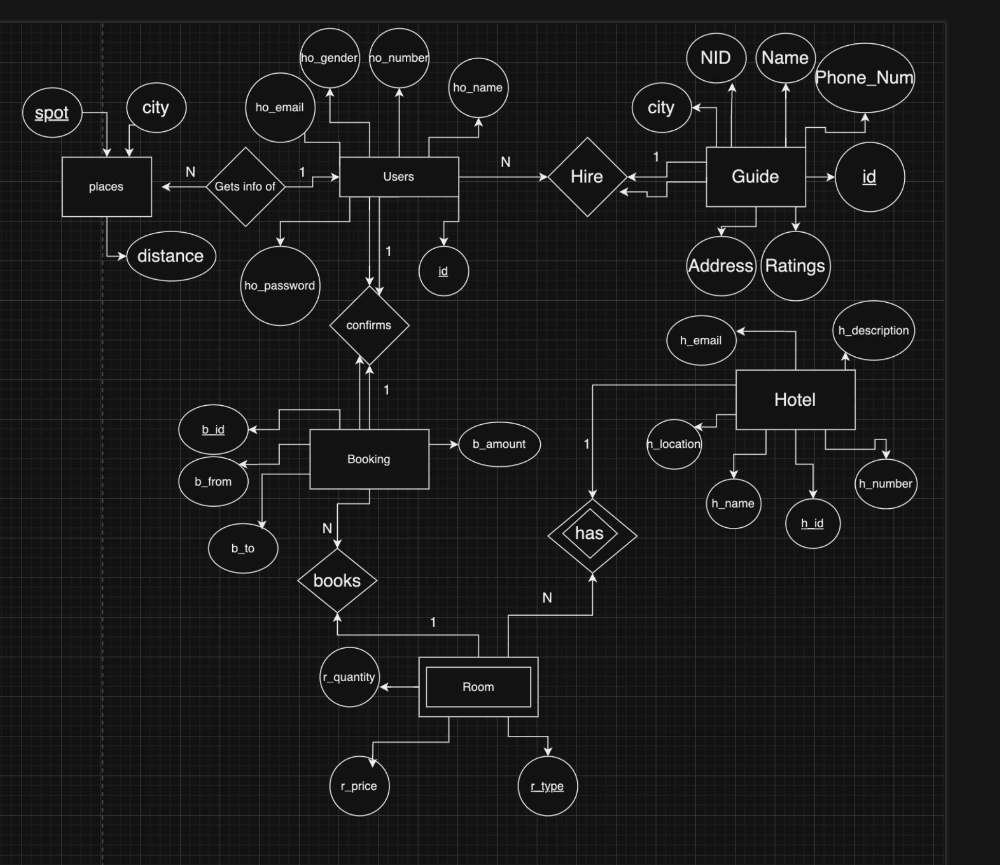
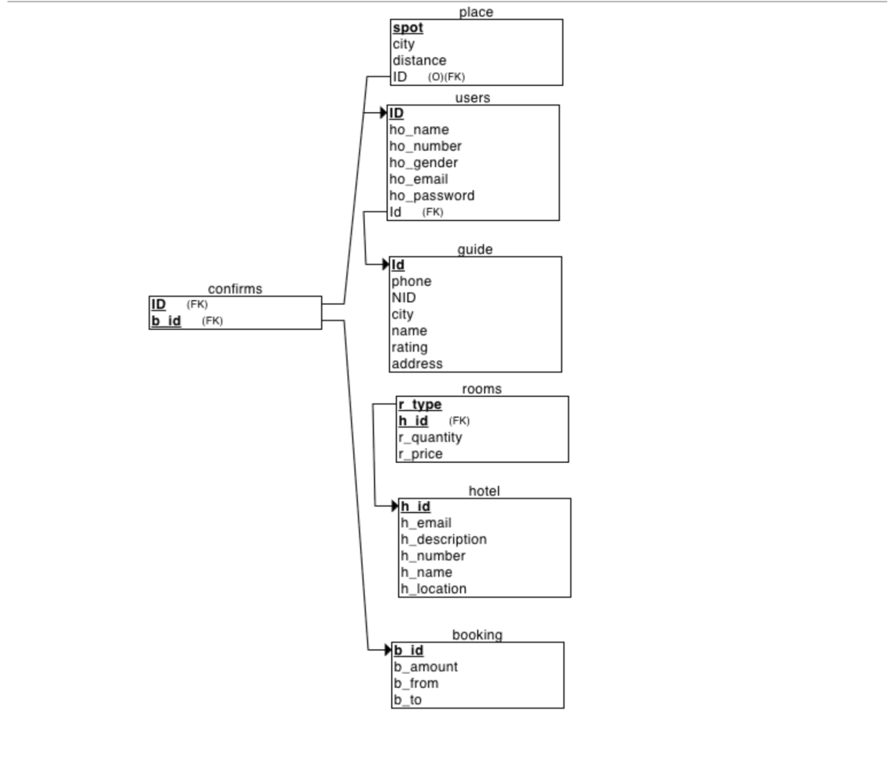
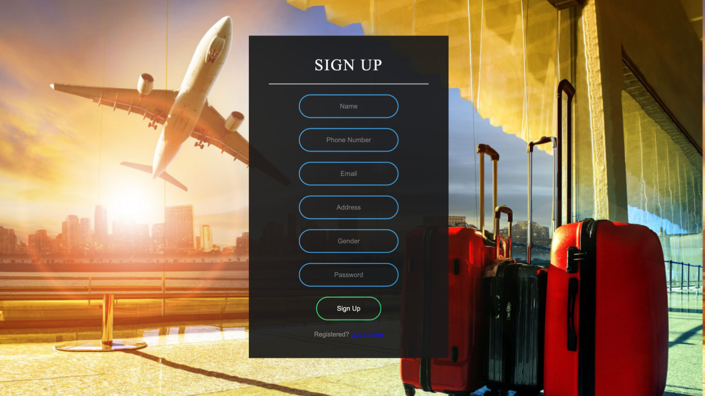
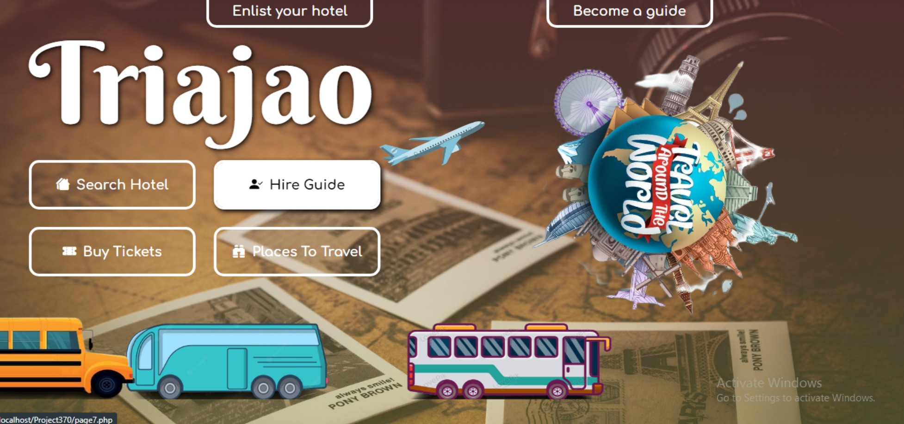
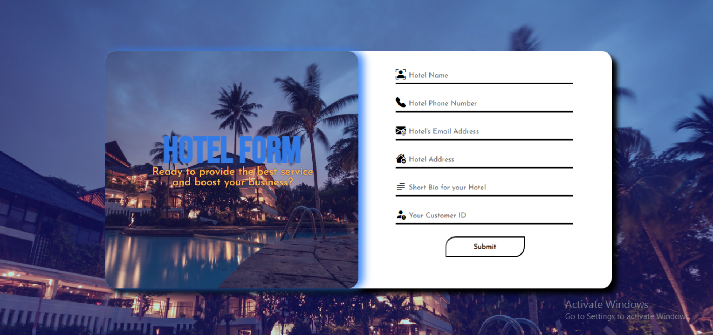
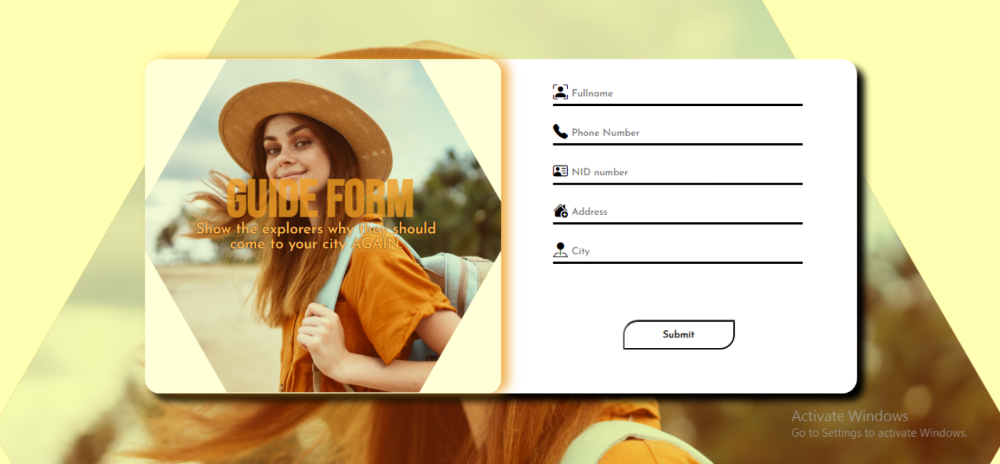
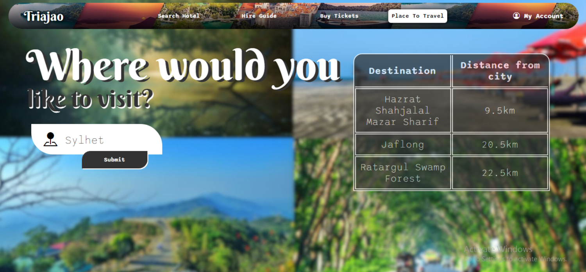
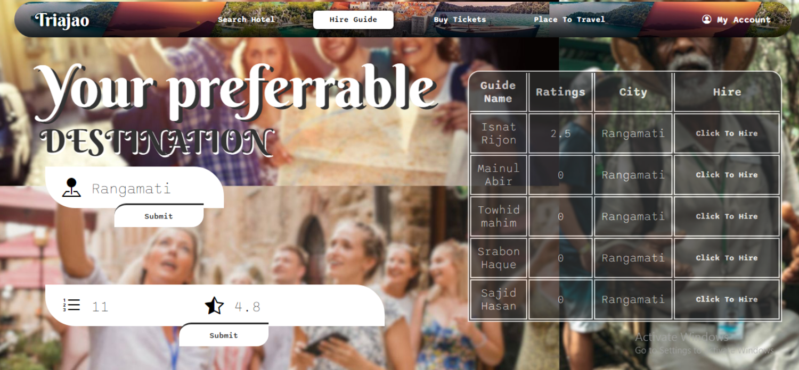
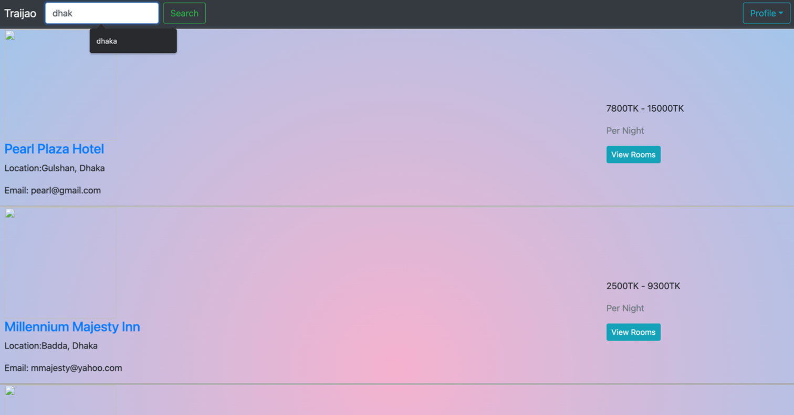
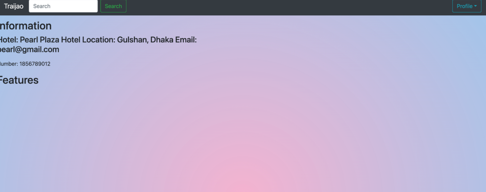

# Triajao:Travel_Hotel_Management_System
Developed a dynamic platform using HTML, PHP, Bootstrap, and MySQL, featuring a user-friendly interface, secure login/signup, and real-time data retrieval. Highlights include reduced page loading times and streamlined processes for hotel booking and guide hiring.
```
DATABASE SYSTEMS - CSE370
```
<!-- <p align="center">
  
</p> 

### Triajao: Travel & Hotel Management System -->

### Made by:
---
#### Habibun Nabi Hemel  
#### Zonayed Hossain Siyam 
#### Asif Mehedi 
---

## 1. Introduction
“**Triajao**” is a website that works like a bucket filled with hotels, tour guides,
and venue suggestions. Our website has 3 segments. One for customers, another
for hotel owners, and the last for tour guides. We are allowing rural people to
help the tourist visit their city. They can sign up just by filling out a form. About
hotels, managers can give all the details we need and enlist their hotel on our
website. Thus they can boost their hotel business. Last but not least, the
customer section, where people can book hotels, get suggestions about where to
visit depending on their desired destination, and book tour guides so they don’t
get lost. All these facilities are just one sign-up away.


## 2. Technologies
The project is built on HTML, PHP , Bootstrap, and MySQL. PHP is employed
to establish a connection with the database, execute SQL queries, and fetch data.
The presentation of the retrieved data is enhanced using HTML and Bootstrap.
The development focuses on creating a Travel & Hotel Management System,
incorporating the following features.

## 3. improving User Experience
This project leverages HTML and PHP to reduce
page loading times significantly. The inclusion of a search bar further enhances
user interaction, enabling them to easily locate hotels, guides, and travel
destinations based on their specific needs. This addition is designed with user
convenience in mind, aiming to streamline the overall experience on the
website.

## 4. Data Management and Security
To ensure seamless navigation, the website
incorporates a secure login and signup panel. User logins are safeguarded by
passwords, and in cases where the entered email and password do not match the
database records, an 'Invalid Username or Password' message is displayed.
Moreover, the signup process enforces mandatory field completion, and any
omission or incorrect data entry triggers an error prompt. By utilizing PHP and
SQL, the website obtains real-time data from the database, simplifying
processes such as hotel room booking and guide hiring.

## 5. Project Features
1. Login and sign up using the user’s email and
password
2. User-friendly interface to see hotels, Guides, and their
info
3. Easy-to-use interface to check availability book hotel
room and book a room
4. Hotel search based on Name, Location
5. Hotel Registration
6. Guide registration and Hire Guide
7. Get suggestions about where to visit
8. Update hotel availability
9. Rate guides


### 6.1 ER/EER Diagram
<p align="center">
  
  <br>
  <br>
  Figure 1: ERR Diagram
</p>

### 3.2 Schema Diagram
<p align="center">
  
  <br>
  <br>
  Figure 2: Schema Diagram
</p>

### 3.3 Sign Up page
Users can sign up on the website by completing the form with a
distinct name, email, phone number, gender, and password. Upon successful completion
of all fields, a message will be displayed, indicating 'Sign up successful.' However, if any
field is left blank, the system will prompt with 'All fields are required.'
<p align="center">
  
  <br>
  <br>
  Figure 3: Sign Up page
</p>

### 3.4 Login page
<p align="center">
  
  <br>
  <br>
  Figure 4:  Login page
</p>

### 3.4 Home Page
The homepage is linked to all other pages that a user should access.
<p align="center">
  
  <br>
  <br>
  Figure 4: Home Page
</p>

### 3.5 Hotel Form
 In this form, hotel managers will register their hotel into our website.
 <p align="center">
  
  <br>
  <br>
  Figure 5: Hotel Form
</p>


### 3.6 Guide Form
Here, through this form natives of respective cities can register to become
a tour guide.
<p align="center">
  
  <br>
  <br>
  Figure 6: Guide Form
</p>


### 3.7 Places To Travel
Here user can write there destination and a table will appear with all
the famous places the user should visit for that corresponding destination.
<p align="center">
  
  <br>
  <br>
</p>

### 3.8 Hire guide
Here users can hire guide according to there desired destination and they
can also rate the guide by their ID which will only appear after the customer
successfully hires him.
<p align="center">
  
  <br>
  <br>
  Figure 8: Hire guide
</p>

### 3.9 Hotel Search
there one can search the hotel by this name or location. Then it will show all
the hotels according to the search
<p align="center">
  
  <br>
  <br>
  Figure 9: Hotel Search
</p>


### 3.10 Hotel Details
Upon selecting a specific hotel, users gain access to details such as the
hotel's name, features, phone number, email, and description. Crucially, users can view
room types and the availability of rooms for a given day. Before placing an order, users
are required to choose check-in and check-out dates. After selecting the dates and
clicking "Check Availability," users will see the chosen date range on the page. If any
rooms are already booked for that day, the user will observe a corresponding decrease
in available room quantity.
<p align="center">
  
  <br>
  <br>
  Figure 10:  Hotel Details
</p>


## 6 Conclusion

In essence, our Travel & Hotel Management System database adeptly addresses the
intricacies of contemporary travel. Through an intuitive user interface, streamlined resource
allocation, timely updates, robust data security, and scalability considerations, we have
developed a comprehensive solution that enhances the experience for travelers, hotel owners,
and tour guides alike. While this report outlines the project's scope and achievements, the
journey toward a fully operational system remains ongoing.

<!-- ## 7 Walkthrough
[](https://www.youtube.com/watch?v=E3jy7NEbZ3A) -->
